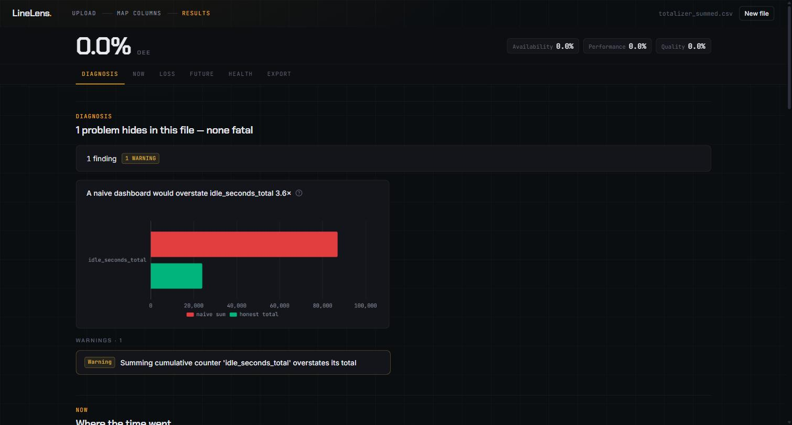
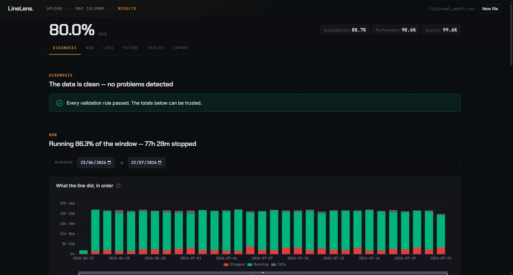
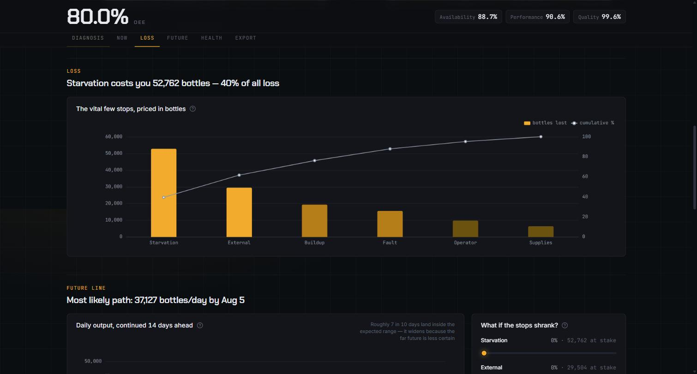
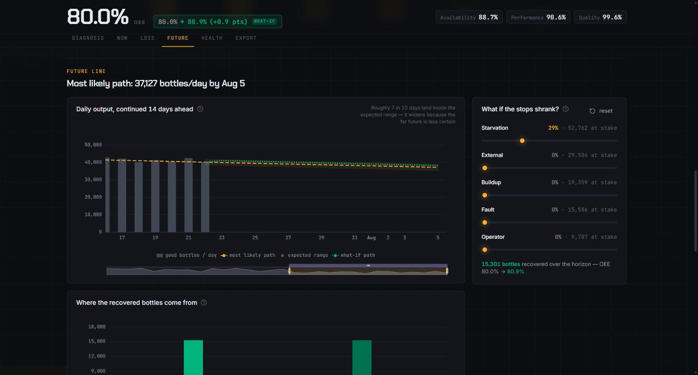
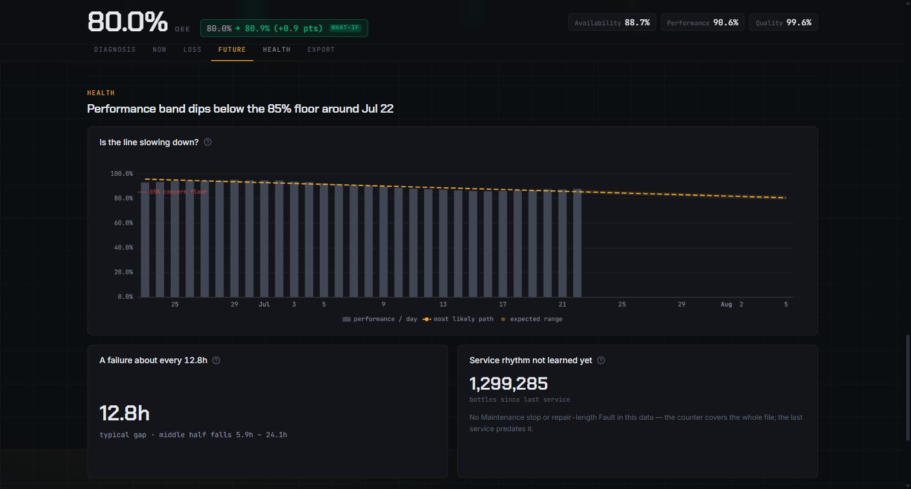
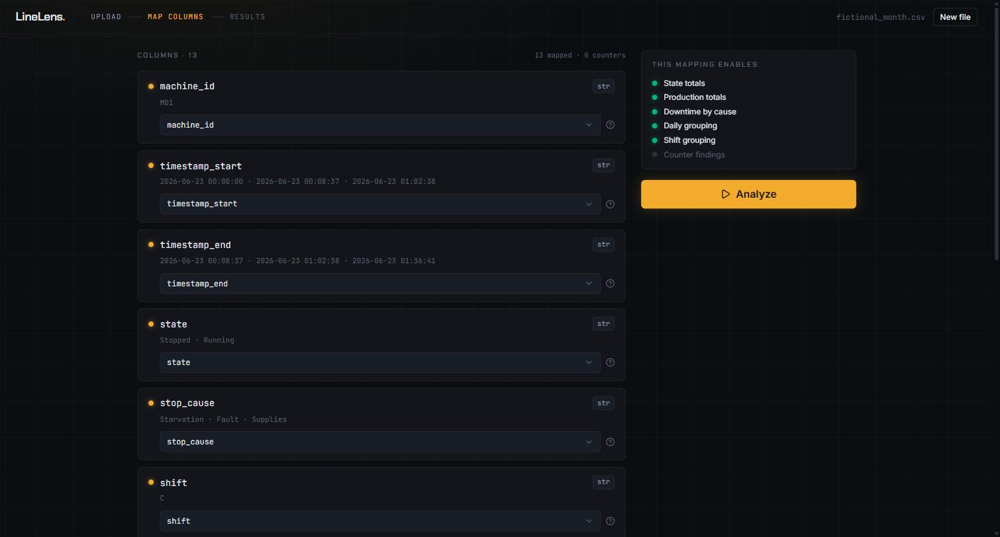

# LineLens

[](https://github.com/RazAndAlex/LineLens/actions/workflows/ci.yml)
[](LICENSE)
[](https://www.python.org/downloads/)

**Local-first diagnostics for industrial machine data.** Give LineLens a CSV
from a PLC, a historian, a SCADA system, or a production database. It checks
the file, totals it honestly, and shows you what it found.

Nothing leaves your machine, and you can check that rather than trust it. Open
the browser network panel and reload: every request goes to `127.0.0.1`. The
typefaces are self-hosted, so there is no font CDN call either. It runs on a
machine with no internet connection.

Industrial dashboards often sum cumulative totalizers. A totalizer is an
odometer, so the correct operation is to difference it, not to add it up. The
result of the mistake is idle time and parts counts that are wrong by multiples,
reported with full confidence.

LineLens finds this class of mistake. It puts the naive number next to the
honest one.

The demo file in this repository holds a summed idle totalizer. It reads 87,000
seconds against a true 24,000, an overstatement of 3.6 times. The tool
calculates the figure in the heading below. Nobody typed it in.



Every calculation, validation, and finding is deterministic. There is no AI in
this path, no estimated total, and no invented severity. The tool never changes
a raw row.

## What you get

You map the columns once. The file then becomes a command deck. A sticky OEE
figure sits at the top with its Availability, Performance, and Quality
satellites. Below it, five sections each answer one question.



**Loss** prices every stop in bottles and ranks the causes. The argument about
where to spend the next maintenance hour then has a number attached to it.



**Future** projects daily output forward as a band, never as a single confident
number. The levers let you shrink a stop cause by a percentage. The horizon and
the OEE move with it.



**Health** answers three questions. Is the line slowing down, how often does it
fail, and when is the next service due.



Mapping is the only step that asks anything of you, and it guesses first. The
panel on the right tells you what each mapping unlocks before you commit to it.



## What it does, precisely

- Accept one CSV. Preview and profile it.
- Map columns with heuristic suggestions, and mark the counters.
- Validate timestamps, durations, and machine states. Show the affected rows.
- Classify each counter as cumulative or unknown, and find resets with a cause.
- Calculate state, production, and downtime totals, overall or by day or shift.
- Flag the headline problem. A dashboard sums a cumulative totalizer instead of
  differencing it, so the tool shows the naive sum against the honest total.
- Compute OEE with an explicit availability scope.
  See [ADR-0003](docs/adr/0003-oee-availability-scope.md).
- Forecast daily good output as a band. The model is gradient-boosted with a
  conformal interval.
  See [ADR-0007](docs/adr/0007-forecast-is-gradient-boosted-with-conformal-band.md).
- Estimate reliability and a maintenance due window.
  See [ADR-0009](docs/adr/0009-predictive-maintenance-service-counter-due-window.md).
- Export a cleaned CSV and a structured findings file, as JSON or CSV.

## Status

**v2.5.** Ten milestones are complete. The first five build the pipeline, from
CSV ingestion to the OEE module and the bottles-lost Pareto. The next five add
the what-if model, the banded forecast, the learned forecast, predictive
maintenance, and the move from Streamlit to FastAPI and React. The old
Streamlit UI is frozen under `archive/streamlit-ui/`.

**121 tests pass.** The CI workflow above runs them on every push. Eleven
architecture decisions are in [`docs/adr/`](docs/adr/). Each one explains a
choice this project had to make, and how it could have gone the other way.

This is not production software. It is a single-user local tool. It has no
authentication, no multi-tenancy, and no hardening. It reads the files you give
it, on your machine.

## Read it without installing it

The [`examples/`](examples/) folder holds committed reports for the synthetic
datasets. You can see the output before you decide to run anything.

- [`totalizer_summed.findings.md`](examples/totalizer_summed.findings.md) is the
  headline case. It reads **87,000 naive against 24,000 honest**.
- [`cumulative_with_reset.findings.md`](examples/cumulative_with_reset.findings.md)
  has a counter reset at row 6, and a **235 against 75** contrast.
- [`valid_event.findings.md`](examples/valid_event.findings.md) is the clean
  case. The answer is that nothing is wrong.

## Run it

You need Python 3.12 or newer and [uv](https://docs.astral.sh/uv/). You also
need Node.js 20 or newer once, to build the frontend.

```bash
git clone https://github.com/RazAndAlex/LineLens.git
cd LineLens

npm --prefix web ci && npm --prefix web run build   # build the UI, first time only
uv sync --extra web --extra forecast                # install the app
uv run python api.py                                # start it
```

A browser opens at http://127.0.0.1:8741. On Windows, `LineLens.bat` does all
of this from one double-click. It builds the frontend for you if the build is
missing.

If port 8741 is busy, uvicorn stops with a bind error. Close whatever owns the
port, usually an older LineLens window, and start again.

Then upload one of the datasets in the repository.

- `sample_data/fictional_month.csv` is a full month of line data. Start here.
- `sample_data/fictional_6month.csv` is six months, about 9,300 rows. The
  charts switch to weekly buckets at this width, and the forecast and the
  reliability estimates have enough history to mean something.
- `sample_data/golden/totalizer_summed.csv` is the 3.6 times case above. Keep
  `idle_seconds_total` mapped as a counter.
- `sample_data/golden/cumulative_with_reset.csv` is a parts totalizer with one
  reset in it.
- `sample_data/valid_event.csv` is clean data with no findings.

## Tests

```bash
uv sync --all-extras --dev
uv run pytest
```

The suite covers units, integration, golden datasets, and the API end to end.
The golden datasets under `sample_data/golden/` carry hand-checked
`.expected.json` files. They are the source of truth for every number. A person
wrote them. No AI derived them.

Without the `forecast` extra, `tests/test_forecast_ml.py` skips itself on
import and the suite shrinks without saying so. This is why CI installs
`--all-extras`.

## Project layout

```
linelens/     the library: ingestion, schema, validation, counters, summaries, reporting
server/       FastAPI backend: routes, serializers, UI-free logic (ADR-0011)
web/          React and TypeScript frontend (Vite, Tailwind, ECharts). Builds to web/dist
api.py        entry point: serves the API and the built frontend on 127.0.0.1:8741
tests/        unit, integration, golden-driven, and API tests
sample_data/  synthetic fixtures. golden/ holds the hand-checked sets
examples/     committed reports, readable on GitHub without running anything
docs/adr/     the eleven architecture decisions
archive/      frozen history: the retired Streamlit UI, kept for reference
```

[`CONTEXT.md`](CONTEXT.md) holds the domain vocabulary and the architecture in
prose. [`docs/LineLens_in_plain_words.md`](docs/LineLens_in_plain_words.md)
explains the whole tool without assuming you know what a totalizer is.
[`docs/adr/`](docs/adr/) indexes the eleven decisions, each with the
alternative it rejected.

[CONTRIBUTING.md](CONTRIBUTING.md) says what is useful to send.
[SECURITY.md](SECURITY.md) states the threat model and the known limits
plainly, because a local tool with no authentication has both.

## Stack

Python and pandas for the core. The core stays pandas-only, so you can import
the library without a web server. FastAPI serves a React and TypeScript
frontend. scikit-learn lives in its own `forecast` extra. Models are
dataclasses, and Pydantic appears only where a boundary earns it.

## License

MIT. See [LICENSE](LICENSE).

Built by Andrei Razvan Alexandru.
